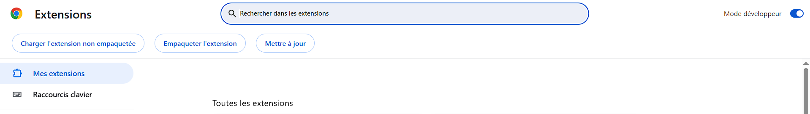
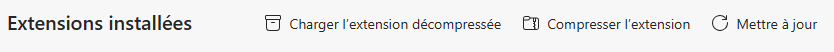
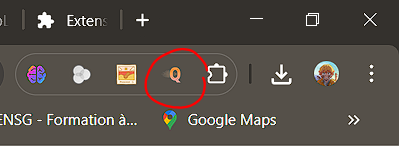

Quickad ⚡
==========


## Comment l'utiliser sur sa machine

> Quickad n'est pas encore disponible sur le Web Store

Dans votre terminal ou directement dans VS Code clonez le git:

```
/* Dans le terminal */
git clone https://github.com/Australes-Inc/Quickad.git

/* Dans VS Code */
Crtl + Shift + G
Cliquez sur Clone Repository 
Entrez: https://github.com/Australes-Inc/Quickad.git
```

## Ajouter l'extension à Chrome (ou Edge)

Ouvrez Chrome et entrez cette URL: [chrome://extensions](chrome://extensions/)(pour Edge: [edge://extensions](edge://extensions/)).

Une fois sur cette page activez le **_Mode développeur_** en haut à droite sur Chrome (dans le menu à gauche sur Edge). Normalement une navbar est apparue:

Chrome: 


Edge:


Maintenant cliquez sur _Charger l'extension non empaquetée_ (respectivement _Charger l'extension décompressée_), votre explorateur de fichiers devrait s'ouvrir. 

Allez chercher le dossier **quickad** dans le dossier du même nom et cliquez sur _Sélectionner un fichier_.

C'est bon, vous avez ajouté l'extension à votre navigateur. N'hésitez pas à l'épingler dans la zone des extensions de votre navigateur:



Maintenant vos pubs sur youtube iront à toute vitesse !

## Licence

Quickad est sous licence MIT ([MIT-LICENSE](./LICENSE) ou [https://opensource.org/license/MIT](https://opensource.org/license/MIT)).

>Réalisé par Diego Posado Bañuls
